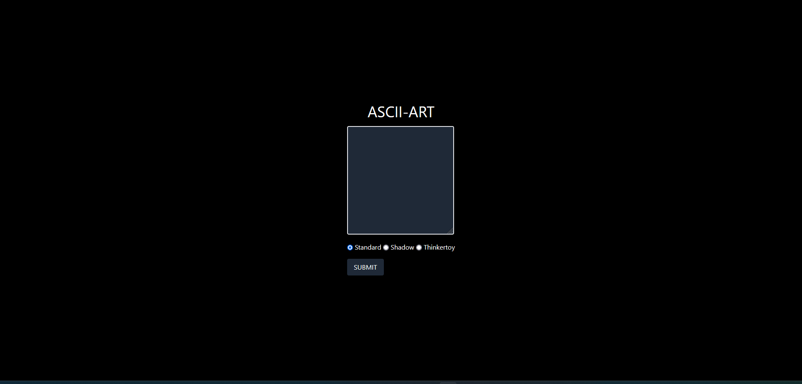

# ascii-art-web

Ascii-art-web is a web-based ASCII Art Generator implemented in Go. It provides a graphical user interface (GUI) for users to convert input text into ASCII art using different banners.



## Authors

- Hasan Ali
- Ahmed Alhamed

## Description

This project extends the functionality of the previous ascii-art project by creating a web server that offers a GUI for generating ASCII art. The web application supports multiple banners, including shadow, standard, and thinkertoy. Users can input text, select a banner, and generate corresponding ASCII art through the web interface.

## Installation and Setup

### Prerequisites

Go (version 1.16 or later)

1. Clone the repository

2. Navigate to the project directory

   ```bash
   cd ascii-art-web
   ```

3. Run the server

   ```bash
   go run .
   ```

   The server runs on port 8080 and has two endpoints:

- `GET /`: The main endpoint that serves the HTML main page.
- `POST /ascii-art`: Handles form submissions to generate ASCII art.

## Usage

1. Open your web browser and navigate to [http://localhost:8080](http://localhost:8080).
2. Enter the text you want to convert into ASCII art.
3. Select a banner from the available options (shadow, standard, thinkertoy).
4. Click the button to generate and display the ASCII art.

## Features

- **Text Input**: Allows users to input the text to be converted into ASCII art.
- **Banner Selection**: Users can choose between different banners (shadow, standard, thinkertoy).
- **Generate Button**: Sends a POST request to generate and display the ASCII art on the page.

## Implementation Details

The ASCII Art Generator uses a simple algorithm to convert each character of the input string into a corresponding ASCII art. The algorithm works by mapping each character to a predefined ASCII art pattern. The patterns are stored in separate files for each font. The algorithm iterates over each character of the input string, retrieves the corresponding ASCII art pattern from the file of the selected font, and appends it to the output string. The output string is then returned as the final ASCII art.

- The `StartLineCalc` function calculates the starting line in the file for a specific ASCII art pattern for a given character.
- The `ReadLines` function reads a specific number of lines from the file starting from a given starting line.
- The `AppendAscii` function appends two ASCII art patterns.
- The `AsciiLine` function generates the ASCII art for a single line of the input string using the previously mentioned functions.
